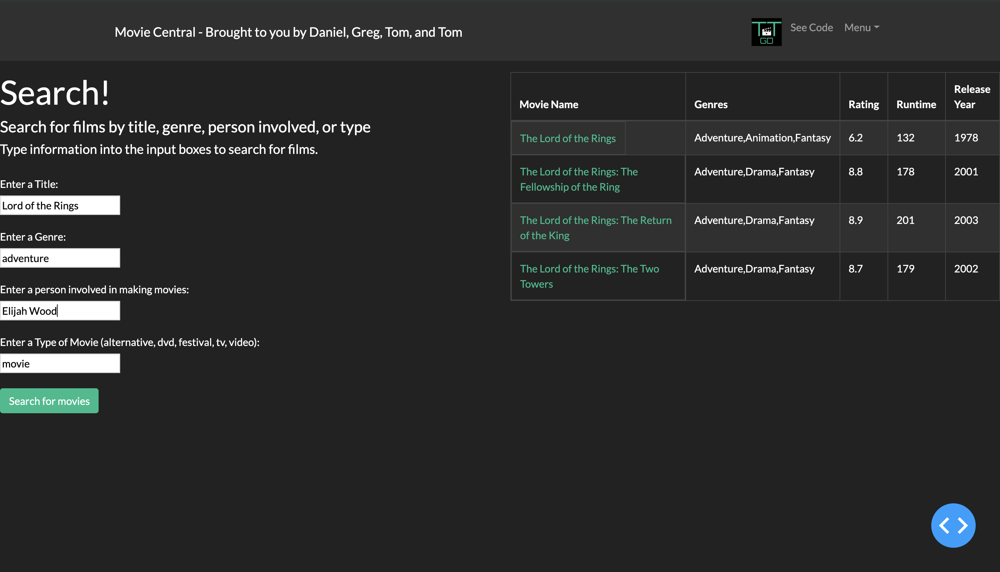

# imdb-analysis

This project creates an online app, which makes it possible to search, rank, and find related productions in the IMDb database. The app uses Dash to display the front-end. In the back-end, it uses a MySQL database, which contains tables with information about movies, in th back-end. 

## App Functionality

The app can do the following things:
 - Search for a production according to ...
 	- its title, 
	- its genre, 
	- involved people, 
	- its type,
	- any combination of them
	

	
 - Rank productions according its average ratings if it received a minimun number of votes from IMDb users in the following categories:
  	- genres (Action, Comedy, Documentary, Fantasy, Sci-Fi, etc.)
  	- type (movie, TV series, short, TV movie, etc.)
  	- time interval (e.g. 2010 - 2015)
  	- year
  	- person involved in production
	

 - Recommend productions similiar to the production specified
 	- calculates similarity score based on following features:
		- type
		- startYear
		- genres
		- director
		- writers
		

- Show statistics about productions in the IMDb database

## File Overview

**_app.py_** :   source code for front-end display of the app (Contributor: Daniel Urke)

**_display.py_** :  code containing function to represent given information in a table format (Contributor: Daniel Urke)

**_search.py_** :  source code for search component (Contributor: Greg Naratil)

**_rank.py_** :  source code for ranking component (Contributor: Tom Wallenstein)

**_recommendation.py_** :  source code for recommendation component (Contributors: Thomas Bischoff & Greg Naratil)

**_stats.py_** : source code for generating the statistics used in the application (Contributors: Tom Wallenstein & Greg Naratil)

**_/assets_** : requirement of dash, holds the static assets of the application (Contributor: Tom Wallenstein (logo))
